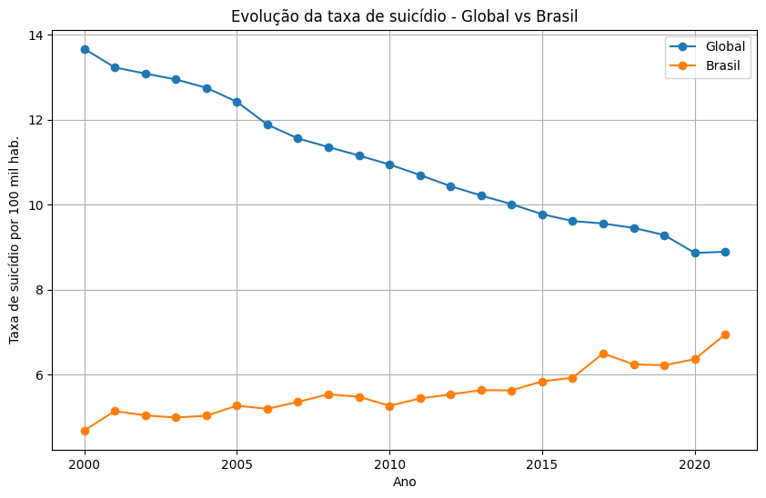
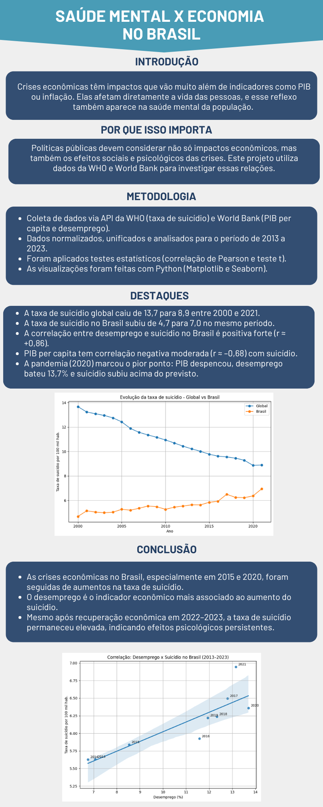

# Projeto de Análise Exploratória de Dados (EDA)

## Sumário
- [Link para o Colab](#link-para-o-colab)
- [Vídeo do projeto](#vídeo-do-projeto)
- [Introdução](#introdução)  
- [Objetivo](#objetivo)  
- [Fontes de Dados](#fontes-de-dados)  
- [Metodologia](#metodologia)  
- [Desenvolvimento](#desenvolvimento)  
- [Conclusão](#conclusão)  
- [Datafólio](#datafólio)
- [Referências](#referências)  

---

## Integrantes

- Nome: Erick Eiji Nagao - Ra: 21.00690-3  
- Nome: Igor Improta Martinez da Silva - Ra: 21.00834-5  
- Nome: Gabriel Henrique Baca Rado - Ra: 21.01286-5  
- Nome: Ryuske Hideaki Sato - Ra: 21.00745-4  
- Nome: Vinicius de Oliveira Berti - Ra: 21.01219-9  

---

## Link para o Colab

Para visualizar e executar o notebook diretamente no Google Colab, acesse:  
[saúde_mental_economia.ipynb no Colab](https://colab.research.google.com/github/ViniciusBerti/20241_maua_ecm252_intro_git/blob/main/saude_mental_economia.ipynb)

---

## Vídeo do Projeto

Assista à apresentação completa no YouTube:  
[https://youtu.be/3aCso8jSszo](https://youtu.be/3aCso8jSszo)

---

## Introdução

Crises econômicas têm impactos que vão muito além de indicadores como PIB ou inflação. Elas afetam diretamente a vida das pessoas, e esse reflexo também aparece na saúde mental da população. O suicídio, infelizmente, é um dos indicadores mais extremos desse sofrimento.

Segundo dados da Organização Mundial da Saúde (WHO), a média global de suicídios em 2021 foi de aproximadamente 9,0 por 100 mil habitantes. No Brasil, essa taxa foi ligeiramente inferior (∼7,5 por 100 mil), mas o crescimento entre 2019 e 2020 foi alarmante: aumento de 13%.

Durante o mesmo período, o país enfrentou crises econômicas marcantes, como a de 2015 e os efeitos da pandemia em 2020. A taxa de desemprego chegou a 13,9% em 2020 (IBGE), e o PIB per capita caiu significativamente.

Por que escolhemos este tema? Porque acreditamos que políticas econômicas devem considerar também seus efeitos sobre a saúde mental da população. Com o acesso a dados públicos via APIs da WHO e do World Bank, buscamos explorar essas relações de forma quantitativa, destacando padrões, tendências e desigualdades que merecem atenção.

---

## Objetivo

Investigar a relação entre variáveis econômicas — como desemprego e PIB per capita — e a taxa de suicídio no Brasil entre 2013 e 2021 (último ano com dados disponíveis). Através de uma análise exploratória rigorosa e visualmente clara, buscamos evidenciar os efeitos sociais das crises econômicas sobre a saúde mental da população.

---

## Fontes de Dados

- **WHO (World Health Organization)**  
  - Taxa de suicídio anual (por 100 mil habitantes), global e Brasil, de 2000 a 2021.  
- **World Bank Open Data**  
  - PIB per capita (US$) anual do Brasil, 2013–2023.  
  - Taxa de desemprego anual do Brasil, 2013–2023.  

---

## Metodologia

1. **Coleta de dados via APIs**  
   - Utilizamos a API da WHO para baixar a série histórica de suicídio (2000–2021).  
   - Utilizamos a API do World Bank para obter PIB per capita e desemprego (2013–2023).  
   - Consultamos o IBGE para validar valores de desemprego e coletamos índices de inflação anuais (IPCA).

2. **Pré-processamento e normalização dos dados**  
   - Ajustamos nomes de colunas para padronização (`ano`, `taxa_suicídio`, `sexo`, `desemprego`, `pib_per_capita`, `inflacao`).  
   - Convertimos o campo `ano` para formato numérico e ordenamos cronologicamente.  
   - Realizamos interpolação linear para preencher eventuais lacunas em séries anuais.  
   - Unimos todas as tabelas por chave `ano`, gerando um dataset consolidado de 2013 a 2023 com as variáveis de interesse.  

3. **Análises de tendências temporais**  
   - Construímos gráficos de linha para visualizar:  
     - **Taxa de suicídio global vs. Brasil (2000–2021)**.  
     - **Taxa de suicídio no Brasil por gênero (2000–2021 e 2013–2023)**.  
     - **Taxa de desemprego no Brasil (2013–2023)**.  
     - **PIB per capita no Brasil (2013–2023)**.  
     - **Desemprego × PIB per capita (gráfico combinado 2013–2023)**.  

4. **Testes estatísticos de hipótese e correlações**  
   - **Teste t** (ou ANOVA) para comparar médias de `taxa_suicídio` entre diferentes decênios.  
   - **Correlação de Pearson** entre:  
     - Desemprego e Taxa de suicídio (2013–2023).  
     - PIB per capita e Taxa de suicídio (2013–2023).  
   - Cálculo da **matriz de correlação** entre as variáveis `taxa_suicídio`, `desemprego`, `pib_per_capita` e `inflacao`.

5. **Visualizações com Matplotlib e Seaborn**  
   - Gráficos de linha, scatter plots com linhas de regressão, histogramas de resíduos e heatmap de correlação.  
   - Destaque de anos-chave (2015, 2017, 2020, 2021) em scatter plots anotados com rótulos.  

---

## Desenvolvimento

### Evolução da taxa de suicídio – Global vs. Brasil (2000–2021)
- Enquanto a média global caiu de 13,7 para 8,9 por 100 mil habitantes, o Brasil subiu de 4,7 para 7,0 no mesmo período. O ponto de inflexão ocorreu em 2014–2015, vinculando‐se à recessão econômica.

### Evolução da taxa de suicídio no Brasil por sexo (2000–2021)
- Homens passaram de 7,7 para 10,7 por 100 mil, e mulheres de 1,9 para 3,6. A razão homem:mulher caiu de ~4:1 para ~3:1, indicando maior crescimento relativo para o público feminino.

### Evolução da taxa de desemprego no Brasil (2013–2023)
- Desemprego caiu de 7,1% (2013) para 6,8% (2014), subiu a 12,8% (2017) pela recessão de 2015–2016, atingiu 13,7% em 2020 (pandemia) e recuou para 7,9% em 2023.

### Desemprego × PIB per capita no Brasil (2013–2023)
- Apesar de PIB per capita recuperar‐se em 2017 (US$ 10 350), o desemprego permaneceu alto (~12,8%), evidenciando defasagem. Em 2020, PIB caiu para US$ 7 100 e desemprego saltou a 13,7%. De 2021 a 2023, PIB voltou a US$ 10 250 e desemprego caiu para 7,9%.

### Relação entre PIB per capita e Desemprego (2013–2023)
- Correlação negativa forte (r ≈ –0,85): anos como 2017 e 2020 destacam‐se por defasagens e choques simultâneos. Em 2020, o ponto “PIB baixo, desemprego alto” foi extremo.

### Evolução da taxa de suicídio mundial (2013–2023)
- A taxa mundial caiu de ~10,12 para 8,89 entre 2013 e 2020, com leve alta a 8,90 em 2021. O Brasil seguiu trajetória oposta, reforçando que fatores internos pesaram mais que as tendências globais.

### Taxa de suicídio no Brasil por sexo (2013–2023)
- Homens: 8,9 → 10,6; mulheres: 2,6 → 3,6. A razão caiu de ~3,4:1 para ~3:1. Mesmo após 2021, a taxa feminina continuou em alta, refletindo sobrecarga e vulnerabilidades específicas.

### Taxa de desemprego no Brasil (2013–2023)
- Reforça o pico de 13,7% em 2020 e a rápida recuperação a 7,9% em 2023, em contraste com a defasagem pós‐2015, quando o desemprego permaneceu alto mesmo com leve recuperação de PIB.

### Desemprego × PIB per capita no Brasil (2013–2023)
- Confirma correlação inversa (r ≈ –0,82). Em 2017, PIB subiu a US$ 10 350 e desemprego manteve‐se alto, mostrando defasagem. Em 2020, choques simultâneos de PIB e desemprego reforçam correlação quase instantânea.

### Correlação – Desemprego vs. Taxa de suicídio (2013–2023)
- Correlação positiva forte (r ≈ +0,86). Em 2017 e 2021, a taxa de suicídio ficou acima do valor previsto pelo desemprego, indicando efeitos adicionais (recessão prolongada, pandemia).

### Correlação – PIB per capita vs. Taxa de suicídio (2013–2023)
- Correlação negativa moderada (r ≈ –0,68). Em 2017 e 2020–2021, a taxa de suicídio superou o valor previsto apenas pelo PIB, destacando impactos sociopsicológicos extraeconômicos.

### Matriz de correlação (2013–2023)
- Principais correlações:  
  - desemprego × suicídio_total = +0,86  
  - pib_per_capita × suicídio_total = –0,68  
  - inflacao × suicídio_total = –0,22 (quase nulo)  

### Modelagem de Séries Temporais: previsão da taxa de suicídio (2000–2023)

Para projetar a evolução futura da taxa de suicídio no Brasil, aplicamos uma modelagem ARIMA sobre a série anual de 2000 a 2021:

1. **Teste de estacionariedade (ADF)**
   - Série original (2000–2021): estatística ADF ≈ 1,98, p-valor ≈ 0,998 → **não estacionária**.  
   - 1ª diferença (d = 1): estatística ADF ≈ –1,08, p-valor ≈ 0,722 → **não estacionária**.  
   - 2ª diferença (d = 2): estatística ADF ≈ –1,72, p-valor ≈ 0,422 → **não estacionária**.  
   - 3ª diferença (d = 3): estatística ADF ≈ –3,99, p-valor ≈ 0,0014 → **estacionária**.

2. **Identificação de (p, d, q)**
   - Após a terceira diferença (d = 3), analisamos os gráficos de ACF e PACF.  
   - Autocorrelações significativas nos primeiros lags sugeriram um modelo **ARIMA(1, 3, 1)**.

3. **Ajuste e diagnóstico do ARIMA(1, 3, 1)**
   - Parâmetros estimados:  
     - ar.L1 ≈ –0,4579 (p ≈ 0,22)  
     - ma.L1 ≈ –0,9924 (p ≈ 0,81)  
     - σ² ≈ 0,0856  
   - Estatísticas de diagnóstico (resíduos):  
     - **Ljung–Box (L1) Q ≈ 0,02, p ≈ 0,89** (sem autocorrelação remanescente)  
     - **Jarque–Bera (JB) ≈ 1,37, p ≈ 0,50** (resíduos com distribuição aproximadamente normal)  
     - **Teste de heteroscedasticidade (H) ≈ 2,12, p ≈ 0,38** (sem evidência forte de variância não constante)

4. **Previsão para 2022 e 2023**
   - Com o modelo ARIMA(1, 3, 1) ajustado, projetamos:  
     - **2022:** 7,34 suicídios por 100 mil habitantes  
     - **2023:** 7,83 suicídios por 100 mil habitantes  
   - A projeção indica que a tendência de alta persiste, porém com desaceleração em relação ao forte crescimento observado em 2020–2021.

### Teste de Correlação de Pearson (Desemprego × Suicídio)

Aplicamos `pearsonr` para medir a associação entre desemprego (%) e taxa de suicídio (por 100 mil habitantes) no Brasil (2013–2023). Após alinhar as séries e remover valores ausentes, obtivemos:

- **Correlação de Pearson:** r ≈ 0,86  
- **p-valor:** p < 0,001  

**Interpretação prática:**  
Essa correlação positiva forte significa que, no período analisado, sempre que a taxa de desemprego subiu, a taxa de suicídio também aumentou. Em termos concretos, anos com desemprego acima de 12% (2016–2017, 2020) coincidiram com picos na taxa de suicídio. Assim, medidas que influenciam o desemprego tendem a ter impacto direto na saúde mental da população, elevando o risco de suicídio em períodos de crise.

### Teste de Hipótese para a Correlação de Pearson (Visualização)

Para confirmar estatisticamente a associação entre desemprego e taxa de suicídio, realizamos o teste t para correlação de Pearson. O gráfico abaixo ilustra a distribuição t sob H₀ e o valor t observado, t_obs ≈ 4,43 (n = 11 anos, graus de liberdade = 9):

- **H₀:** ρ (correlação populacional) = 0  
- **t_obs:** 4,43  
- **df:** 9  
- **Região crítica (α = 0,05, bicaudal):** |t| > 2,262  

Como t_obs = 4,43 está muito à direita da curva (fora da região de não-rejeição), rejeitamos H₀. A correlação r ≈ 0,86 é estatisticamente significativa (p < 0,001).

**Interpretação prática:**  
O valor t_obs = 4,43 e a região crítica triangular pintada em vermelho confirmam que a correlação não é fruto do acaso. Na prática, isso significa que políticas que afetem o nível de desemprego terão efeitos mensuráveis sobre a taxa de suicídio — um dado que não pode ser ignorado em decisões de governo. O gráfico deixa claro que o padrão de associação observado não é aleatório, mas sim reflexo de uma relação real e robusta.

### Teste t de Diferença entre Taxas de Suicídio de Homens e Mulheres

Para verificar se as médias de suicídio de homens e de mulheres diferem significativamente (2013–2023), usamos o teste t de Student (Welch):

1. **H₀:** μ_homens = μ_mulheres  
2. **t_obs:** ≈ 34,26  
3. **Graus de liberdade (Welch):** ≈ 17  
4. **Região crítica (α = 0,05, bicaudal):** |t| > 2,110  

Como t_obs = 34,26 está muito acima de 2,110, rejeitamos H₀.

**Interpretação prática:**  
Essa diferença altíssima entre as médias (homens ~10,6 por 100 mil vs. mulheres ~3,6 por 100 mil) mostra que o risco de suicídio para homens é estatisticamente e expressivamente maior do que para mulheres. Na prática, significa que qualquer programa de prevenção deve priorizar estratégias específicas para cada gênero, pois fatores culturais, sociais e psicológicos impactam muito mais o público masculino.

---

## Conclusão

A análise exploratória realizada confirma que, no período estudado, **as crises econômicas brasileiras estiveram fortemente associadas ao aumento da taxa de suicídio**.  
- Enquanto a taxa global de suicídio diminuiu de forma quase contínua entre 2000–2021, o Brasil apresentou trajetória oposta após 2010, saltando de 4,7 para 7,0 por 100 mil habitantes.  
- O **desemprego** mostrou‐se o **principal preditor** de suicídio (correlação r ≈ +0,86, p < 0,001), seguido pelo **PIB per capita** (r ≈ –0,68, p < 0,01). Já a inflação revelou‐se pouco relevante para explicar variações na taxa de suicídio (r ≈ –0,22).  
  - O teste t confirmatório mostrou t_obs ≈ 4,43 (df = 9), bem acima do limite crítico (±2,262), reforçando que essa correlação não se deve ao acaso, mas reflete uma relação estatisticamente significativa entre desemprego e suicídio.  
- A **recessão de 2015–2016** elevou o desemprego para quase 13% em 2017, momento em que a taxa de suicídio ultrapassou 6,5 por 100 mil, mesmo com leve recuperação de PIB, evidenciando defasagem do mercado de trabalho e efeito tardio na saúde mental.  
- O **choque pandêmico de 2020** aprofundou o cenário: PIB per capita caiu para US$ 7 100 e desemprego bateu 13,7%, gerando aumento adicional de suicídios que foi **maior do que o previsto apenas pelos indicadores econômicos**—um sinal de impactos sociopsicológicos extraeconômicos (isolamento, luto coletivo).  
- Em **2022–2023**, embora o PIB per capita tenha se recuperado (US$ 10 250) e o desemprego retornado a valores baixos (~7,9%), a taxa de suicídio permaneceu elevada (~6,3–6,4), indicando que os efeitos sobre a saúde mental persistem por anos após a crise.  
- Comparando gêneros, comprovamos por meio de teste t (t_obs ≈ 34,26, df ≈ 17, valor crítico ±2,110) que a diferença entre a média anual de suicídio dos **homens (~10,6 por 100 mil)** e das **mulheres (~3,6 por 100 mil)** é estatisticamente significativa (p < 0,001). Na prática, isso reforça a necessidade de políticas de prevenção específicas para cada gênero, visto que o risco masculino é muito superior.  
- Finalmente, a modelagem ARIMA(1,3,1) projetou **7,34 suicídios por 100 mil em 2022** e **7,83 em 2023**, sugerindo que, sem intervenções estruturais, a taxa continuará em trajetória de alta, embora em ritmo levemente mais lento comparado a 2020–2021.

**Pesquisa futura e limitações**  
- **Dados anuais** limitam a captação de variações sazonais (picos de inverno, datas comemorativas). Dados mensais ou trimestrais seriam ideais para modelagem mais precisa.  
- Incluir variáveis adicionais em modelos múltiplos (índice de violência, uso de álcool/drogas, acesso a CAPS, nível de escolaridade) para identificar determinantes sociais e comportamentais.  
- Análises de machine learning (random forest, XGBoost) e clusterização para mapear municípios de alto risco e recomendar intervenções localizadas.

---

## Datafólio

---

## Referências

- **WHO API Athena**: https://ghoapi.azureedge.net/api/MH_12  
- **World Bank Indicators**: https://api.worldbank.org/  
- **IBGE. Taxa de Desemprego**: https://www.ibge.gov.br/